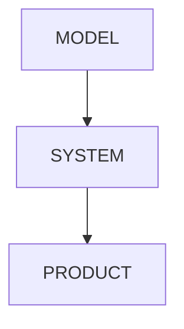
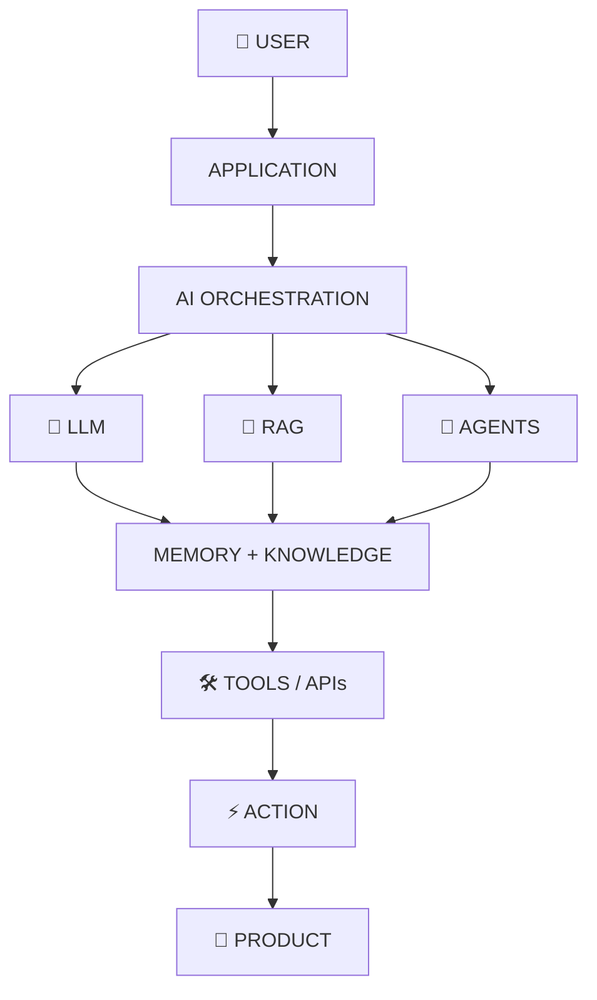
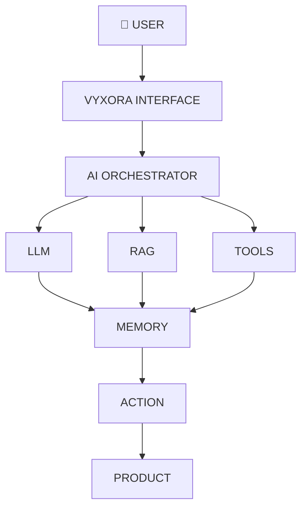

<div align="center">

<!-- ═══════════════════════════════════════════════════════════════ -->
<!--                        ANIMATED HERO                           -->
<!-- ═══════════════════════════════════════════════════════════════ -->


<br>


<br><br>

<a href="https://www.linkedin.com/in/goyal-krish31/">

</a>
<a href="https://krish-goyal.netlify.app/">

</a>
<a href="https://vyxora.netlify.app/">

</a>
<a href="mailto:krishgoyal3101@gmail.com">

</a>

<br><br>


<br><br>


<br><br>


</div>

<br>

<div align="center">


<br>

### AI / ML ENGINEER &nbsp;•&nbsp; GENERATIVE AI BUILDER &nbsp;•&nbsp; AGENTIC AI &nbsp;•&nbsp; FULL-STACK

<br>

> <b>Turning models, intelligence and ideas into real software products.</b>

</div>

<br>

---

# 🧠 `THE BUILDER`

## Building at the intersection of AI & software.

I'm an **AI/ML Engineer, Generative AI Builder and Full-Stack Engineer** focused on turning artificial intelligence into usable products.

My work spans:

- 🔹 **Machine Learning & Deep Learning**
- 🔹 **Generative AI & LLM applications**
- 🔹 **AI Agents & agentic workflows**
- 🔹 **RAG / KAG & knowledge systems**
- 🔹 **NLP & Computer Vision**
- 🔹 **Backend & API engineering**
- 🔹 **Full-stack product development**
- 🔹 **Production-oriented AI systems**

### My core idea



<div align="center">

```text
╭──────────────────────────────╮
│       ⚡ AI LAB STATUS       │
├──────────────────────────────┤
│  🧠 AI ENGINE      ████████  │
│  🤖 AGENTS         ████████  │
│  🔗 RAG / KAG      ████████  │
│  ⚙️  BACKENDS      ████████  │
│  🌐 FULL STACK     ████████  │
│                              │
│  STATUS: ● BUILDING          │
╰──────────────────────────────╯
```


</div>

---

# ⚡ `AI STACK`

<div align="center">


</div>

### 🧠 Machine Learning


`Machine Learning` · `Deep Learning` · `NLP` · `Computer Vision`

### 🤖 Generative AI


`LLMs` · `RAG` · `KAG` · `AI Agents` · `LangGraph` · `Embeddings` · `Vector Search` · `Tool Calling`

### 🌐 Full-Stack


`React` · `Next.js` · `TypeScript` · `Node.js` · `Express` · `FastAPI` · `Tailwind` · `REST APIs`

### ☁️ Data / Cloud / DevOps


`MongoDB` · `PostgreSQL` · `MySQL` · `Redis` · `Docker` · `Kubernetes` · `AWS` · `Azure` · `Git` · `Linux`

---

# 🌌 `AI SYSTEM ARCHITECTURE`

<div align="center">


</div>



---

# 🚀 `FLAGSHIP BUILD — VYXORA`

<div align="center">


<br>


</div>

<br>

## What is VYXORA?

**VYXORA** is an AI-powered multi-module productivity platform combining intelligent chat, AI writing, browser-based development, web generation and developer utilities.

It brings multiple AI-powered workflows into one unified product experience.

### Core capabilities

- 🤖 **AI Chat** — Intelligent AI interaction.
- ✍️ **AI Writing** — AI-assisted content creation.
- 💻 **Browser IDE** — Development directly in the browser.
- 🌐 **Web Generation** — AI-powered web experiences.
- 🛠️ **Developer Tools** — Practical utilities for developers.

### Product flow



<div align="center">

<a href="https://vyxora.netlify.app/">

</a>

<br><br>


<br><br>

> **Don't just build an AI feature. Build an AI product.**

</div>

---

# 📊 `ENGINEERING TELEMETRY`

<div align="center">


<br><br>

<a href="https://github.com/Krishgoyal31">

</a>

<a href="https://github.com/Krishgoyal31">

</a>

<br><br>


<br><br>


</div>

---

# 🌌 `ACTIVITY STREAM`

<div align="center">


<br><br>


<br><br>


</div>

---

# 🐍 `CONTRIBUTION ENGINE`

<div align="center">


<br><br>


<br><br>

<picture>
  <source
    media="(prefers-color-scheme: dark)"
    srcset="https://raw.githubusercontent.com/Krishgoyal31/Krishgoyal31/output/github-contribution-grid-snake-dark.svg"
  />
  <source
    media="(prefers-color-scheme: light)"
    srcset="https://raw.githubusercontent.com/Krishgoyal31/Krishgoyal31/output/github-contribution-grid-snake.svg"
  />
  
</picture>

<br><br>


</div>

---

# 🖥️ `DEVELOPER TERMINAL`

<div align="center">


<br><br>


</div>

```text
krish@ai-lab ~ % whoami
> AI/ML Engineer

krish@ai-lab ~ % focus
> Generative AI
> Agentic Systems
> RAG / KAG
> NLP
> Full-Stack Engineering

krish@ai-lab ~ % current
> VYXORA

krish@ai-lab ~ % philosophy
> MODEL → SYSTEM → PRODUCT

krish@ai-lab ~ % status
> ● ONLINE
```

<div align="center">


</div>

---

# ✦ `ENGINEERING PHILOSOPHY`

<div align="center">

| | | |
|:---:|:---:|:---:|
| 🧠 <br> **LEARN DEEPLY** | 🏗️ <br> **BUILD WITH PURPOSE** | 🚀 <br> **SHIP CONSTANTLY** |
| 📐 <br> **ENGINEER FOR SCALE** | 🔥 <br> **IMPROVE RELENTLESSLY** | 🌌 <br> **STAY CURIOUS** |

<br>


</div>

---

# 🌠 `WHAT'S NEXT`

<div align="center">


<br><br>

| 🤖 | 🧠 | 🔗 | ⚡ |
|:---:|:---:|:---:|:---:|
| **AGENTIC AI** <br> Autonomous workflows | **GENERATIVE AI** <br> LLM-powered systems | **KNOWLEDGE SYSTEMS** <br> RAG / KAG | **AI PRODUCTS** <br> Production systems |

</div>

---

# 💜 `LET'S BUILD`

<div align="center">


<br>


<br><br>


<br><br>

<a href="https://www.linkedin.com/in/goyal-krish31/">

</a>
<a href="https://krish-goyal.netlify.app/">

</a>
<a href="https://vyxora.netlify.app/">

</a>
<a href="mailto:krishgoyal3101@gmail.com">

</a>

<br><br>

<sub>AI · SYSTEMS · PRODUCTS · INNOVATION</sub>

</div>

<br>

---

<div align="center">


<br><br>


<br>


</div>
