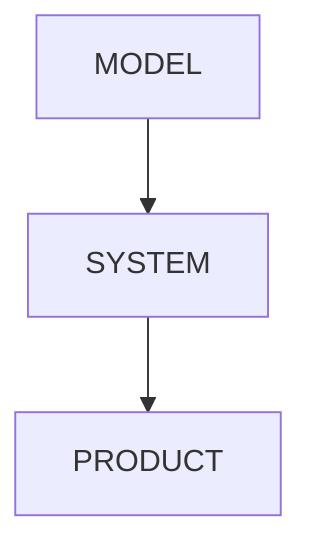
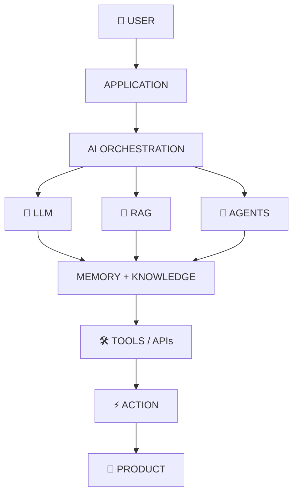
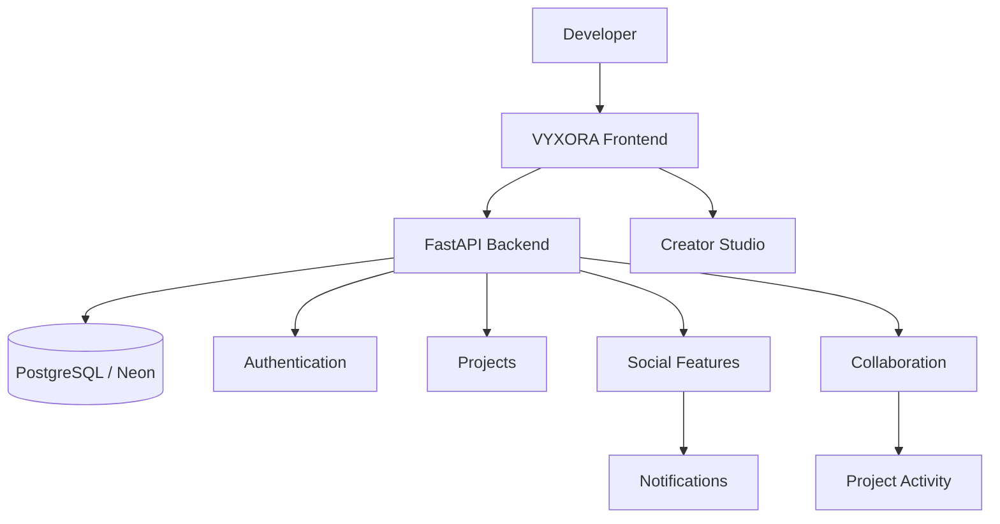
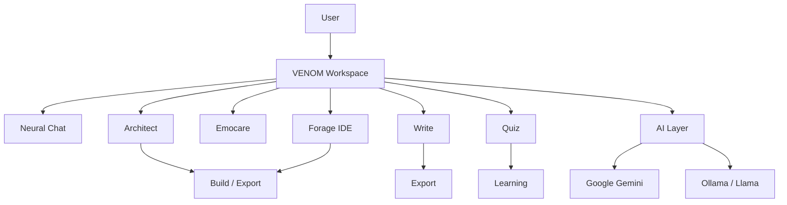

<!-- ═══════════════════════════════════════════════════════════════ -->
<!--                        ANIMATED HERO                           -->
<!-- ═══════════════════════════════════════════════════════════════ -->

AI / ML ENGINEER  •  GENERATIVE AI BUILDER  •  AGENTIC AI  •  FULL-STACK

<b>Turning models, intelligence and ideas into real software products.</b>

🧠 THE BUILDER
Building at the intersection of AI & software.
I'm an AI/ML Engineer, Generative AI Builder and Full-Stack Engineer focused on turning artificial intelligence into usable products.
My work spans:
- 🔹 Machine Learning & Deep Learning
- 🔹 Generative AI & LLM applications
- 🔹 AI Agents & agentic workflows
- 🔹 RAG / KAG & knowledge systems
- 🔹 NLP & Computer Vision
- 🔹 Backend & API engineering
- 🔹 Full-stack product development
- 🔹 Production-oriented AI systems
My core idea

```mermaid
flowchart TD
    A[MODEL] --> B[SYSTEM] --> C[PRODUCT]
```

╭──────────────────────────────╮
│       ⚡ AI LAB STATUS       │
├──────────────────────────────┤
│  🧠 AI ENGINE      ████████  │
│  🤖 AGENTS         ████████  │
│  🔗 RAG / KAG      ████████  │
│  ⚙️  BACKENDS      ████████  │
│  🌐 FULL STACK     ████████  │
│                              │
│  STATUS: ● BUILDING          │
╰──────────────────────────────╯

⚡ AI STACK

🧠 Machine Learning

Machine Learning · Deep Learning · NLP · Computer Vision
🤖 Generative AI

LLMs · RAG · KAG · AI Agents · LangGraph · Embeddings · Vector Search · Tool Calling
🌐 Full-Stack

HTML · CSS · JavaScript · Python · FastAPI · PostgreSQL · REST APIs
☁️ Data / Cloud / DevOps

MongoDB · PostgreSQL · MySQL · Redis · Docker · Kubernetes · AWS · Azure · Git · Linux
🌌 AI SYSTEM ARCHITECTURE

```mermaid
flowchart TD
    U[👤 USER] --> AP[APPLICATION] --> OR[AI ORCHESTRATION]
    OR --> LLM[🧠 LLM]
    OR --> RAG[🔗 RAG]
    OR --> AG[🤖 AGENTS]
    LLM --> MEM[MEMORY + KNOWLEDGE]
    RAG --> MEM
    AG --> MEM
    MEM --> TOOLS[🛠️ TOOLS / APIs]
    TOOLS --> ACT[⚡ ACTION]
    ACT --> PROD[🚀 PRODUCT]
```
🚀 FLAGSHIP BUILDS

🌐 VYXORA
The Developer-First Project Ecosystem

VYXORA is a developer-first social and collaboration platform where developers can publish projects, build their profiles, discover other creators, connect, and collaborate.
✨ Core Features
- 🚀 Project Publishing — Publish and showcase development projects.
- 👤 Developer Profiles — Build a public identity around your work.
- 🔎 Project Discovery — Discover projects and other builders.
- ❤️ Likes & Bookmarks — Engage with and save projects.
- 💬 Comments & Replies — Discuss projects with creators.
- 🤝 Collaboration Requests — Find contributors and collaborate.
- 💬 Messaging & Connections — Connect with other developers.
- 🔔 Notifications — Stay updated on platform activity.
- 📊 Project Activity — Track meaningful project interactions.
- 🎨 Creator Studio — Manage and publish your projects.
🛠️ Tech Stack
HTML · CSS · JavaScript · Python · FastAPI · PostgreSQL · Neon
🏗️ Architecture

```mermaid
flowchart TD
    U[Developer] --> FE[VYXORA Frontend]
    FE --> API[FastAPI Backend]
    API --> DB[(PostgreSQL / Neon)]
    API --> AUTH[Authentication]
    API --> PROJECTS[Projects]
    API --> SOCIAL[Social Features]
    API --> COLLAB[Collaboration]
    SOCIAL --> NOTIFY[Notifications]
    COLLAB --> ACTIVITY[Project Activity]
    FE --> STUDIO[Creator Studio]
```

Build it. Showcase it. Find your people. Collaborate.

🧠 VENOM
Where Intelligence Meets Productivity

VENOM (Very Efficient Neural Operating Machine) is a multi-module AI workspace that brings AI chat, coding, writing, application generation, learning, and productivity workflows into one environment.
✨ Core Modules
- 🧠 Neural Chat — AI assistance for questions, ideas, and problem solving.
- 🏗️ Architect — Generate and modify frontend projects using natural language.
- 💙 Emocare — AI-assisted wellness and relaxation experiences.
- 💻 Forage IDE — Write and work with code.
- ✍️ Write — Create styled handwritten notes and export them.
- 🧩 Quiz — Generate quizzes, evaluate answers, and learn with AI assistance.
⚡ Key Capabilities
- 🔐 BYOK — Bring Your Own API Key.
- 🤖 Google Gemini — Generative AI capabilities.
- 🦙 Ollama / Llama — Local AI workflows.
- 💻 Developer Tools — Coding and project-generation workflows.
- 🧩 Multi-Module Workspace — Multiple AI workflows in one product.
🛠️ Tech Stack
Python · FastAPI · PyQt · Google Gemini API · Ollama · Llama
🏗️ Architecture

```mermaid
flowchart TD
    U[User] --> V[VENOM Workspace]

    V --> CHAT[Neural Chat]
    V --> ARCH[Architect]
    V --> EMO[Emocare]
    V --> IDE[Forage IDE]
    V --> WRITE[Write]
    V --> QUIZ[Quiz]

    V --> AI[AI Layer]

    AI --> GEMINI[Google Gemini]
    AI --> OLLAMA[Ollama / Llama]

    ARCH --> BUILD[Build / Export]
    IDE --> BUILD
    WRITE --> EXPORT[Export]
    QUIZ --> LEARN[Learning]
```

One workspace. Multiple intelligent workflows.

⚡ PROJECT SNAPSHOT

Project	Focus	Stack	Live
VYXORA	Developer social & collaboration platform	HTML · CSS · JavaScript · FastAPI · PostgreSQL · Neon	Open
VENOM	Multi-module AI productivity workspace	Python · FastAPI · PyQt · Gemini · Ollama · Llama	Open

VYXORA connects builders. VENOM amplifies builders.

📊 ENGINEERING TELEMETRY

🌌 ACTIVITY STREAM

🐍 CONTRIBUTION ENGINE

<picture>
  <source
    media="(prefers-color-scheme: dark)"
    srcset="https://raw.githubusercontent.com/Krishgoyal31/Krishgoyal31/output/github-contribution-grid-snake-dark.svg"
  />
  <source
    media="(prefers-color-scheme: light)"
    srcset="https://raw.githubusercontent.com/Krishgoyal31/Krishgoyal31/output/github-contribution-grid-snake.svg"
  />
  
</picture>

🖥️ DEVELOPER TERMINAL

krish@ai-lab ~ % whoami
> AI/ML Engineer

krish@ai-lab ~ % focus
> Generative AI
> Agentic Systems
> RAG / KAG
> NLP
> Full-Stack Engineering

krish@ai-lab ~ % current
> VYXORA + VENOM

krish@ai-lab ~ % philosophy
> MODEL → SYSTEM → PRODUCT

krish@ai-lab ~ % status
> ● ONLINE

✦ ENGINEERING PHILOSOPHY

		
🧠 
 LEARN DEEPLY	🏗️ 
 BUILD WITH PURPOSE	🚀 
 SHIP CONSTANTLY
📐 
 ENGINEER FOR SCALE	🔥 
 IMPROVE RELENTLESSLY	🌌 
 STAY CURIOUS

🌠 WHAT'S NEXT

🤖	🧠	🔗	⚡
AGENTIC AI 
 Autonomous workflows	GENERATIVE AI 
 LLM-powered systems	KNOWLEDGE SYSTEMS 
 RAG / KAG	AI PRODUCTS 
 Production systems

💜 LET'S BUILD

AI · SYSTEMS · PRODUCTS · INNOVATION

