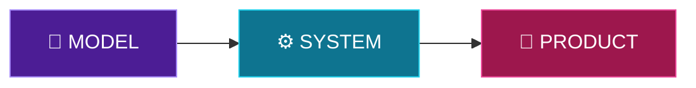
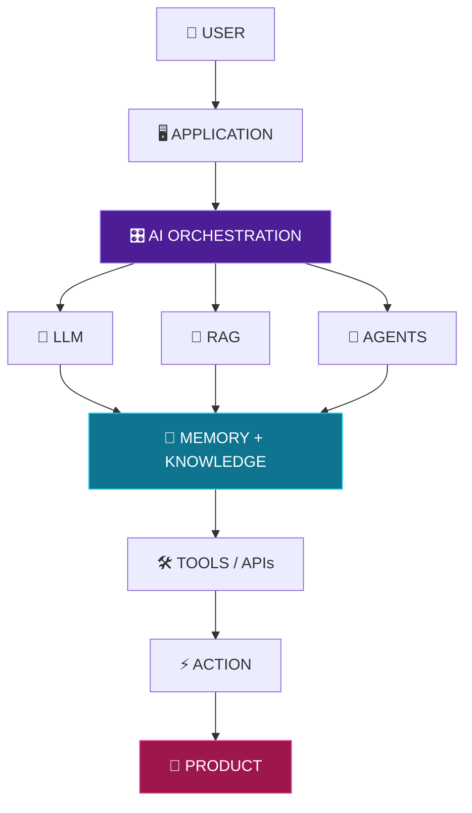
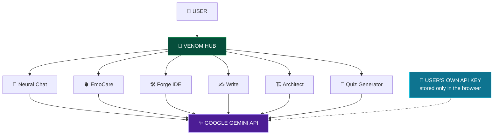
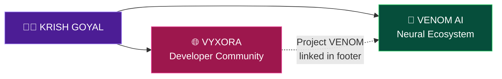
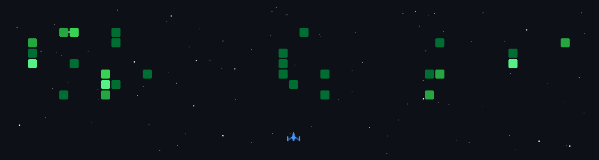

<div align="center">

<!-- ═══════════════════════════════════════════════════════════════ -->
<!--                          HERO SECTION                          -->
<!-- ═══════════════════════════════════════════════════════════════ -->


<br>


<br><br>

<a href="https://www.linkedin.com/in/goyal-krish31/"></a>
<a href="https://krish-goyal.netlify.app/"></a>
<a href="https://vyxora.netlify.app/"></a>
<a href="https://venomm-ai.netlify.app/"></a>
<a href="mailto:krishgoyal3101@gmail.com"></a>

<br><br>


<br><br>


<br><br>


</div>

<br>

<div align="center">


<br>

### AI / ML ENGINEER &nbsp;•&nbsp; GENERATIVE AI BUILDER &nbsp;•&nbsp; AGENTIC AI &nbsp;•&nbsp; FULL-STACK

<br>

> <b>Turning models, intelligence and ideas into real software products.</b>

</div>

<br>

---

# 🧠 `THE BUILDER`

## Building at the intersection of AI & software.

I'm an **AI/ML Engineer, Generative AI Builder and Full-Stack Engineer** focused on turning artificial intelligence into usable products. Two live platforms back that up: **VYXORA**, a developer community, and **VENOM AI**, a six-module AI ecosystem.

My work spans:

- 🔹 **Machine Learning & Deep Learning**
- 🔹 **Generative AI & LLM applications**
- 🔹 **AI Agents & agentic workflows**
- 🔹 **RAG / KAG & knowledge systems**
- 🔹 **NLP & Computer Vision**
- 🔹 **Backend & API engineering**
- 🔹 **Full-stack product development**
- 🔹 **Production-oriented AI systems**

### My core idea


```mermaid
flowchart LR
    A["🧠 MODEL"] --> B["⚙️ SYSTEM"] --> C["🚀 PRODUCT"]
    style A fill:#4C1D95,stroke:#A78BFA,color:#fff
    style B fill:#0E7490,stroke:#22D3EE,color:#fff
    style C fill:#9D174D,stroke:#EC4899,color:#fff
```

<div align="center">

```text
╭──────────────────────────────────────╮
│          ⚡ AI LAB STATUS            │
├──────────────────────────────────────┤
│  🧠 AI ENGINE        ████████████    │
│  🤖 AGENTS           ████████████    │
│  🔗 RAG / KAG        ████████████    │
│  ⚙️  BACKENDS         ████████████    │
│  🌐 FULL STACK       ████████████    │
│  🚀 LIVE PRODUCTS    ██ VYXORA        │
│                      ██ VENOM AI     │
│                                      │
│  STATUS: ● BUILDING                  │
╰──────────────────────────────────────╯
```


</div>

---

# ⚡ `AI STACK`

<div align="center">


</div>

### 🧠 Machine Learning


`Machine Learning` · `Deep Learning` · `NLP` · `Computer Vision`

### 🤖 Generative AI


`LLMs` · `Google Gemini` · `RAG` · `KAG` · `AI Agents` · `LangGraph` · `Embeddings` · `Vector Search` · `Tool Calling`

### 🌐 Full-Stack


`React` · `Next.js` · `TypeScript` · `Node.js` · `Express` · `FastAPI` · `Tailwind` · `REST APIs`

### ☁️ Data / Cloud / DevOps


`MongoDB` · `PostgreSQL` · `MySQL` · `Redis` · `Docker` · `Kubernetes` · `AWS` · `Azure` · `Netlify` · `Git` · `Linux`

<div align="center">


</div>

---

# 🌌 `AI SYSTEM ARCHITECTURE`

<div align="center">


</div>


```mermaid
flowchart TD
    U["👤 USER"] --> AP["🖥️ APPLICATION"] --> OR["🎛️ AI ORCHESTRATION"]
    OR --> LLM["🧠 LLM"]
    OR --> RAG["🔗 RAG"]
    OR --> AG["🤖 AGENTS"]
    LLM --> MEM["💾 MEMORY + KNOWLEDGE"]
    RAG --> MEM
    AG --> MEM
    MEM --> TOOLS["🛠️ TOOLS / APIs"]
    TOOLS --> ACT["⚡ ACTION"]
    ACT --> PROD["🚀 PRODUCT"]
    style OR fill:#4C1D95,stroke:#A78BFA,color:#fff
    style MEM fill:#0E7490,stroke:#22D3EE,color:#fff
    style PROD fill:#9D174D,stroke:#EC4899,color:#fff
```

---

# 🚀 `FLAGSHIP BUILDS`

<div align="center">


</div>

<br>

## 🌐 VYXORA &nbsp;·&nbsp; *Build what matters. Show the world.*

<div align="center">

<a href="https://vyxora.netlify.app/">

</a>

<br>

<a href="https://vyxora.netlify.app/"></a>
<a href="https://vyxora.netlify.app/Vyxora_Documentation.pdf"></a>
<a href="https://vyxora.netlify.app/Vyxora_Setup_Guide.pdf"></a>

</div>

<br>

**VYXORA** is *the home of ambitious developers*: a community platform where builders publish their work, get discovered, and team up on projects. Developers share projects with a cover, a GitHub repository, a live demo and a full description, and the publisher automatically becomes the verified owner.

| Feature | What it does |
|:--|:--|
| 📤 **Project Publishing** | Publish work with a cover image (JPG / PNG / WEBP), GitHub repo, live preview and description |
| 👤 **Creator Profiles** | Public profile with avatar, bio, project count, total views and selected work |
| 🔎 **Discovery** | Search creators by name or `@username`, and filter projects by category |
| 🤝 **Collaboration** | Invites, join requests, open positions, team activity, analytics and ownership transfer |
| 💬 **Messaging** | Direct creator conversations plus an official support channel |
| 🔔 **Notifications** | One unified feed for activity on your work |
| 🔖 **Saved Library** | Bookmark projects worth returning to |
| 🗨️ **Discussion** | Comment threads on every project |
| 🔐 **Auth & Recovery** | Email or Google sign-in, profile editing, password change, secure account recovery |

<details>
<summary><b>📂 &nbsp;Project categories supported</b></summary>
<br>

`AI / Machine Learning` · `SaaS` · `Portfolio` · `Dashboard` · `E-commerce` · `Data Science` · `Developer Tool` · `Open Source` · `HealthTech` · `Content Platform` · `Other`

</details>

<details>
<summary><b>🗺️ &nbsp;Platform flow: how VYXORA works end to end</b></summary>
<br>


```mermaid
flowchart LR
    A["👤 ACCOUNT<br/>Email or Google"] --> B["📤 PUBLISH<br/>Cover · Repo · Demo"]
    B --> C["🔎 DISCOVER<br/>Browse & filter"]
    C --> D["🙋 REQUEST<br/>Ask to join"]
    D --> E["🤝 TEAM<br/>Build together"]
    B --> F["📈 GROWTH<br/>Views · Follows · Feedback"]
    F --> G["🔔 NOTIFY<br/>Owner alerted"]
    style A fill:#4C1D95,stroke:#A78BFA,color:#fff
    style B fill:#9D174D,stroke:#EC4899,color:#fff
    style C fill:#0E7490,stroke:#22D3EE,color:#fff
    style D fill:#4C1D95,stroke:#A78BFA,color:#fff
    style E fill:#166534,stroke:#22C55E,color:#fff
    style F fill:#0E7490,stroke:#22D3EE,color:#fff
    style G fill:#9D174D,stroke:#EC4899,color:#fff
```

</details>

<div align="center">


</div>

<br>

<div align="center">

</div>

<br>

## 🐍 VENOM AI &nbsp;·&nbsp; *Beyond Algorithms. Pure Intelligence.*

<div align="center">

<a href="https://venomm-ai.netlify.app/">

</a>

<br>

<a href="https://venomm-ai.netlify.app/"></a>
<a href="https://venomm-ai.netlify.app/main"></a>
<a href="https://venomm-ai.netlify.app/guidelines"></a>

</div>

<br>

**VENOM** is an *industrial-grade intelligence collective* engineered to bridge abstract cognition and high-performance execution. It brings six AI modules together in one neural command center.

| Module | What it does |
|:--|:--|
| 💬 **Neural Chat** | Context-aware conversational AI with natural, multi-turn dialogue |
| 🫀 **EmoCare** | AI emotional-wellness tracking using real-time facial and sentiment analysis |
| 🛠️ **Forge IDE** | Multi-language cloud IDE with AI code completion, refactoring and collaboration |
| ✍️ **Write** | Turns digital text into realistic handwritten documents with neural synthesis |
| 🏗️ **Architect** | Describe a website in plain language and get production-ready code |
| 🧪 **Quiz Generator** | Builds tests and knowledge assessments on any subject |


```mermaid
flowchart TD
    U["👤 USER"] --> H["🐍 VENOM HUB"]
    H --> M1["💬 Neural Chat"]
    H --> M2["🫀 EmoCare"]
    H --> M3["🛠️ Forge IDE"]
    H --> M4["✍️ Write"]
    H --> M5["🏗️ Architect"]
    H --> M6["🧪 Quiz Generator"]
    M1 & M2 & M3 & M4 & M5 & M6 --> G["✨ GOOGLE GEMINI API"]
    K["🔑 USER'S OWN API KEY<br/>stored only in the browser"] -.-> G
    style H fill:#064E3B,stroke:#22C55E,color:#fff
    style G fill:#4C1D95,stroke:#A78BFA,color:#fff
    style K fill:#0E7490,stroke:#22D3EE,color:#fff
```

> 🔐 **Privacy by design:** VENOM runs on a bring-your-own **Gemini API key**, kept only in your browser and never sent to VENOM's servers. It can also be installed as an app, and desktop is recommended for the full experience.

<div align="center">


<br><br>

> **Don't just build an AI feature. Build an AI product.**

</div>

### 🔗 The ecosystem


```mermaid
flowchart LR
    K["👨‍💻 KRISH GOYAL"] --> V["🌐 VYXORA<br/>Developer Community"]
    K --> N["🐍 VENOM AI<br/>Neural Ecosystem"]
    V -. "Project VENOM<br/>linked in footer" .-> N
    style K fill:#4C1D95,stroke:#A78BFA,color:#fff
    style V fill:#9D174D,stroke:#EC4899,color:#fff
    style N fill:#064E3B,stroke:#22C55E,color:#fff
```

---

# 📊 `ENGINEERING TELEMETRY`

<div align="center">


<br><br>

<a href="https://github.com/Krishgoyal31">

</a>

<a href="https://github.com/Krishgoyal31">

</a>

<br><br>


<br><br>


</div>

---

# 🌌 `ACTIVITY STREAM`

<div align="center">


<br><br>


<br><br>


</div>

---

# 🚀 `CONTRIBUTION SPACE SHOOTER`

<div align="center">


<br><br>


<br><br>

<!-- Generated daily by .github/workflows/update-game.yml (gh-space-shooter) -->


<br><br>


</div>

---

# 🖥️ `DEVELOPER TERMINAL`

<div align="center">


<br><br>


</div>

```text
krish@ai-lab ~ % whoami
> AI/ML Engineer

krish@ai-lab ~ % focus
> Generative AI
> Agentic Systems
> RAG / KAG
> NLP & Computer Vision
> Full-Stack Engineering

krish@ai-lab ~ % ls ./live-products
> vyxora/      # developer community & creator network
> venom-ai/    # 6-module neural AI ecosystem

krish@ai-lab ~ % philosophy
> MODEL → SYSTEM → PRODUCT

krish@ai-lab ~ % status
> ● ONLINE
```

<div align="center">


</div>

---

# ✦ `ENGINEERING PHILOSOPHY`

<div align="center">

| | | |
|:---:|:---:|:---:|
| 🧠 <br> **LEARN DEEPLY** | 🏗️ <br> **BUILD WITH PURPOSE** | 🚀 <br> **SHIP CONSTANTLY** |
| 📐 <br> **ENGINEER FOR SCALE** | 🔥 <br> **IMPROVE RELENTLESSLY** | 🌌 <br> **STAY CURIOUS** |

<br>


</div>

---

# 🌠 `WHAT'S NEXT`

<div align="center">


<br><br>

| 🤖 | 🧠 | 🔗 | ⚡ |
|:---:|:---:|:---:|:---:|
| **AGENTIC AI** <br> Autonomous workflows | **GENERATIVE AI** <br> LLM-powered systems | **KNOWLEDGE SYSTEMS** <br> RAG / KAG | **AI PRODUCTS** <br> Production systems |

</div>

---

# 💜 `LET'S BUILD`

<div align="center">


<br>


<br><br>


<br><br>

<a href="https://www.linkedin.com/in/goyal-krish31/"></a>
<a href="https://krish-goyal.netlify.app/"></a>
<a href="https://vyxora.netlify.app/"></a>
<a href="https://venomm-ai.netlify.app/"></a>
<a href="mailto:krishgoyal3101@gmail.com"></a>

<br><br>

<sub>AI · SYSTEMS · PRODUCTS · INNOVATION</sub>

</div>

<br>

---

<div align="center">


<br><br>


<br>


</div>
