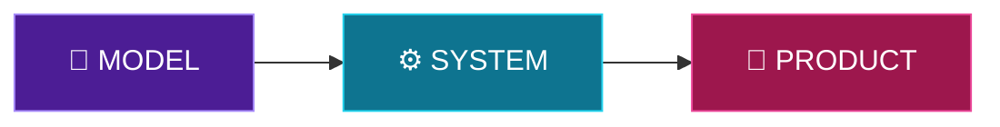
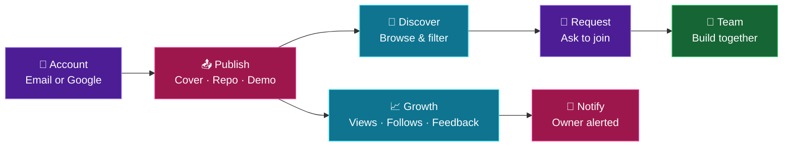
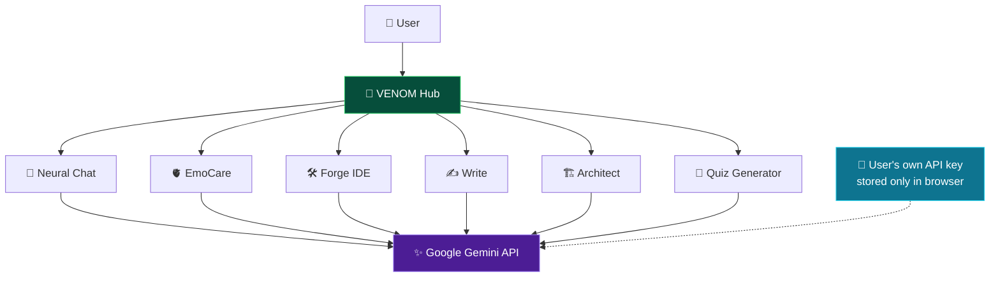
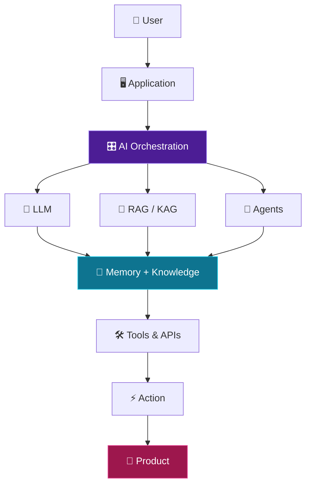

<div align="center">


<a href="https://github.com/Krishgoyal31">

</a>

<br/>

<a href="https://www.linkedin.com/in/goyal-krish31/"></a>
<a href="https://krish-goyal.netlify.app/"></a>
<a href="https://vyxora.netlify.app/"></a>
<a href="https://venomm-ai.netlify.app/"></a>
<a href="mailto:krishgoyal3101@gmail.com"></a>

<br/><br/>


</div>

<br/>

---

## 🧠 &nbsp;About Me

> **I turn models into systems, and systems into products people can actually use.**

I'm an **AI/ML Engineer and Full-Stack Builder** who ships end-to-end: from the model and the prompt layer, to the backend, to the interface in the browser. Two live products to show for it:

| | Product | What it is |
|:-:|:--|:--|
| 🌐 | **[VYXORA](https://vyxora.netlify.app/)** | A developer community and creator network to publish projects, get discovered, and find collaborators |
| 🐍 | **[VENOM AI](https://venomm-ai.netlify.app/)** | A six-module AI "neural ecosystem": chat, emotion analysis, cloud IDE, handwriting synthesis, web builder and quiz generator |


```mermaid
flowchart LR
    A["🧠 MODEL"] --> B["⚙️ SYSTEM"] --> C["🚀 PRODUCT"]
    style A fill:#4C1D95,stroke:#A78BFA,color:#fff
    style B fill:#0E7490,stroke:#22D3EE,color:#fff
    style C fill:#9D174D,stroke:#EC4899,color:#fff
```

<br/>

---

## 🚀 &nbsp;Featured Projects

<div align="center">

### 🌐 VYXORA &nbsp;·&nbsp; *Build what matters. Show the world.*

<a href="https://vyxora.netlify.app/">

</a>

<a href="https://vyxora.netlify.app/"></a>
<a href="https://vyxora.netlify.app/Vyxora_Documentation.pdf"></a>
<a href="https://vyxora.netlify.app/Vyxora_Setup_Guide.pdf"></a>

</div>

**VYXORA** is *the home of ambitious developers*: a community platform where builders publish their work, get discovered, and team up on projects.

| Feature | What it does |
|:--|:--|
| 📤 **Project Publishing** | Share work with a cover image, GitHub repository, live demo link and full description. The publisher becomes the verified owner. |
| 👤 **Creator Profiles** | Public developer profile with avatar, bio, project count, total views and selected work. |
| 🔎 **Discovery** | Search creators by name or `@username`, and filter projects by category. |
| 🤝 **Collaboration** | Invites, join requests, open positions, team activity, analytics and ownership transfer. |
| 💬 **Messaging & Notifications** | Direct creator conversations, an official support channel and a unified activity feed. |
| 🔖 **Saved Library** | Bookmark projects worth returning to. |
| 🗨️ **Community Discussion** | Comment threads on every project. |
| 🔐 **Auth & Recovery** | Email or Google sign-in, profile editing, password change and a secure account-recovery flow. |

<details>
<summary><b>📂 Project categories supported</b></summary>
<br/>

`AI / Machine Learning` · `SaaS` · `Portfolio` · `Dashboard` · `E-commerce` · `Data Science` · `Developer Tool` · `Open Source` · `HealthTech` · `Content Platform` · `Other`

</details>

<details>
<summary><b>🗺️ Platform flow (how VYXORA works end to end)</b></summary>
<br/>


```mermaid
flowchart LR
    A["👤 Account<br/>Email or Google"] --> B["📤 Publish<br/>Cover · Repo · Demo"]
    B --> C["🔎 Discover<br/>Browse & filter"]
    C --> D["🙋 Request<br/>Ask to join"]
    D --> E["🤝 Team<br/>Build together"]
    B --> F["📈 Growth<br/>Views · Follows · Feedback"]
    F --> G["🔔 Notify<br/>Owner alerted"]
    style A fill:#4C1D95,stroke:#A78BFA,color:#fff
    style B fill:#9D174D,stroke:#EC4899,color:#fff
    style C fill:#0E7490,stroke:#22D3EE,color:#fff
    style D fill:#4C1D95,stroke:#A78BFA,color:#fff
    style E fill:#166534,stroke:#22C55E,color:#fff
    style F fill:#0E7490,stroke:#22D3EE,color:#fff
    style G fill:#9D174D,stroke:#EC4899,color:#fff
```

</details>

<br/>

<div align="center">

### 🐍 VENOM AI &nbsp;·&nbsp; *Beyond Algorithms. Pure Intelligence.*

<a href="https://venomm-ai.netlify.app/">

</a>

<a href="https://venomm-ai.netlify.app/"></a>
<a href="https://venomm-ai.netlify.app/main"></a>
<a href="https://venomm-ai.netlify.app/guidelines"></a>

</div>

**VENOM** is an *industrial-grade intelligence collective* that bridges abstract cognition and high-performance execution, delivered as one unified platform of six AI modules.

| Module | What it does |
|:--|:--|
| 💬 **Neural Chat** | Context-aware conversational AI with multi-turn dialogue. |
| 🫀 **EmoCare** | AI emotional-wellness tracking using real-time facial and sentiment analysis. |
| 🛠️ **Forge IDE** | Multi-language cloud IDE with AI code completion, refactoring and collaboration. |
| ✍️ **Write** | Converts digital text into realistic handwritten documents via neural synthesis. |
| 🏗️ **Architect** | Describe a website in plain language and get production-ready code generated. |
| 🧪 **Quiz Generator** | Builds tests and knowledge assessments on any subject. |


```mermaid
flowchart TD
    U["👤 User"] --> H["🐍 VENOM Hub"]
    H --> M1["💬 Neural Chat"]
    H --> M2["🫀 EmoCare"]
    H --> M3["🛠️ Forge IDE"]
    H --> M4["✍️ Write"]
    H --> M5["🏗️ Architect"]
    H --> M6["🧪 Quiz Generator"]
    M1 & M2 & M3 & M4 & M5 & M6 --> G["✨ Google Gemini API"]
    K["🔑 User's own API key<br/>stored only in browser"] -.-> G
    style H fill:#064E3B,stroke:#22C55E,color:#fff
    style G fill:#4C1D95,stroke:#A78BFA,color:#fff
    style K fill:#0E7490,stroke:#22D3EE,color:#fff
```

> 🔐 **Privacy by design:** VENOM runs on a *bring-your-own* Gemini API key that is stored **only in your browser** (`localStorage`) and never sent to the VENOM servers. It is also installable as an app (PWA). Desktop is recommended for the full experience.

<br/>

---

## ⚡ &nbsp;Tech Stack

<div align="center">

| Domain | Tools |
|:--|:--|
| 🧠 **Machine Learning** |      |
| 🤖 **Generative AI** |      |
| 🌐 **Frontend** |     |
| ⚙️ **Backend** |    |
| 🗄️ **Data** |     |
| ☁️ **DevOps & Cloud** |        |

</div>

<br/>

---

## 🌌 &nbsp;How I Think About AI Systems


```mermaid
flowchart TD
    U["👤 User"] --> APP["🖥️ Application"] --> OR["🎛️ AI Orchestration"]
    OR --> LLM["🧠 LLM"]
    OR --> RAG["🔗 RAG / KAG"]
    OR --> AG["🤖 Agents"]
    LLM --> MEM["💾 Memory + Knowledge"]
    RAG --> MEM
    AG --> MEM
    MEM --> TOOLS["🛠️ Tools & APIs"] --> ACT["⚡ Action"] --> PROD["🚀 Product"]
    style OR fill:#4C1D95,stroke:#A78BFA,color:#fff
    style MEM fill:#0E7490,stroke:#22D3EE,color:#fff
    style PROD fill:#9D174D,stroke:#EC4899,color:#fff
```

<br/>

---

## 📊 &nbsp;GitHub Stats

<div align="center">

<a href="https://github.com/Krishgoyal31">


</a>

<br/>


<br/><br/>

<picture>
  <source media="(prefers-color-scheme: dark)" srcset="https://raw.githubusercontent.com/Krishgoyal31/Krishgoyal31/output/github-contribution-grid-snake-dark.svg"/>
  <source media="(prefers-color-scheme: light)" srcset="https://raw.githubusercontent.com/Krishgoyal31/Krishgoyal31/output/github-contribution-grid-snake.svg"/>
  
</picture>

</div>

<br/>

---

## 🖥️ &nbsp;Developer Terminal

```text
krish@ai-lab ~ % whoami
> Krish Goyal · AI/ML Engineer · Full-Stack Builder

krish@ai-lab ~ % ls ./projects
> vyxora/     # developer community & creator network
> venom-ai/   # 6-module AI neural ecosystem

krish@ai-lab ~ % cat focus.txt
> Generative AI · Agentic Systems · RAG / KAG · NLP · Computer Vision · Full-Stack

krish@ai-lab ~ % echo $PHILOSOPHY
> Systems over shortcuts. Architecture over complexity. Ship constantly.

krish@ai-lab ~ % status
> ● ONLINE · BUILDING
```

<br/>

---

## 🌠 &nbsp;What's Next

| 🤖 Agentic AI | 🔗 Knowledge Systems | 🧠 Generative AI | 🚀 AI Products |
|:-:|:-:|:-:|:-:|
| Autonomous, tool-using workflows | RAG / KAG pipelines | LLM-powered applications | From prototype to production |

<br/>

---

## 💜 &nbsp;Let's Build

<div align="center">


<br/>

<a href="https://www.linkedin.com/in/goyal-krish31/"></a>
<a href="https://krish-goyal.netlify.app/"></a>
<a href="https://vyxora.netlify.app/"></a>
<a href="https://venomm-ai.netlify.app/"></a>
<a href="mailto:krishgoyal3101@gmail.com"></a>

<br/><br/>


</div>
